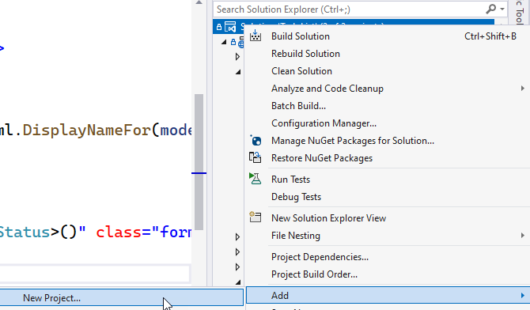
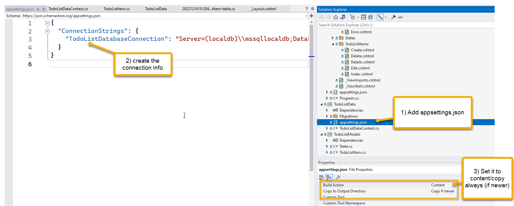

# MSSA CCAD 8

Started on 10/24/2022
Week 10: 2022.12.12 - 2022.12.16

## Week 9 - HTML/CSS/JS/Angular

## Day 1 -

Finish up HTML/CSS/JS Unit with a look at Angular

### Morning Things

1. Self Joins
1. Generic Method for PrintArray
1. PHP/Server-Side Development Question - We'll see some similar stuff in MVC

### Angular Demo

1. Created an angular app

1. Added components

    - Home Component
    
1. Showed click event and live updates from Angular

    - Compare and contrast angular to vanilla javascript

1. Added routing

1. Added code to repeat meals

1. Added interface for meal object and constant array of Meal

1. Served the meals on the page from the constant variable

1. Repeated with vehicles

1. Transferred getVehicles() to an asynchronous observable service

1. Retrieved vehicles from service

1. Switched to having the service pull vehicles from the azure function endpoint.

## Afternoon

Lab work:

### Tour of Heroes / Work on your site 

- [Angular Tour Of Heroes](https://angular.io/tutorial/toh-pt0)  

## Day 2 -

ASP.Net MVC Core

### Morning

Welcome to MVC!

1. Getting started

Module 1 of the MVC course, discussed

- history of MVC/.Net Framework/.NET core
- how MVC works

1. Quick Demo

Built an app and discussed

- Controllers and Routing
- Convention over configuration
- How to work with views and controllers
    - Naming
    - Passing data to views from controllers

[See this app](./Week_10/TodoList/)  

1. Lab 1

### Afternoon

Module 2 - SDLC and Building a robust app

1. Module 2 slides

1. Lab 2

    - Learn how to model classes

## Conclusion

We're off and running with MVC!

## Day 3

Database, Models, Views, Scaffolding

### Morning

We did slides for module 6 then saw how to use all of the stuff in our own projects by adding the ability to leverage our database (pre-work for module 7)  

1. Create the database project

    Right-click and Add a new project to the solution.

    

1. Add a project reference to your model project

    -right-click and add project reference.  Select the models project.

1. Bring in NuGet Packages

    Add the following NuGet packages:

    - Microsoft.EntityFrameworkCore
    - Microsoft.EntityFrameworkCore.SqlServer
    - Microsoft.Extensions.Configuration
    - Microsoft.Extensions.Configuration.Json

    ```xml
    <ItemGroup>
        <PackageReference Include="Microsoft.EntityFrameworkCore" Version="7.0.1" />
        <PackageReference Include="Microsoft.EntityFrameworkCore.SqlServer" Version="7.0.1" />
        <PackageReference Include="Microsoft.Extensions.Configuration" Version="7.0.0" />
        <PackageReference Include="Microsoft.Extensions.Configuration.Json" Version="7.0.0" />
    </ItemGroup>
    ```  

1. Add Configuration

    - Add `appsettings.json` to the database project
    - Set the connection string in the appsettings file
    - Make sure the file is copy if newer/always and set to content

     

    >**Note:** Put the additional connection string in the web appsettings.json as well.

1. Create the Context Class

    Add a new class to the database project

    - implement DbContext
    ```cs  
    public class TodoListDataContext : DbContext
    {
        private static IConfigurationRoot _configuration;
    ```  
    >**Note:** Make sure to also include the `IConfigurationRoot` variable here (seen above)

    ```
    private static IConfigurationRoot _configuration;
    ```  

    You'll need that variable later for the configuration to get the connection string.

    - create default constructor  
    - create explicit constructor  

    ```cs
    public TodoListDataContext()
    {
        //leave this here for scaffolding, etc
    }

    public TodoListDataContext(DbContextOptions options) : base(options) 
    {
        //purposefully blank
    }

    ```  

    - add OnConfiguring

    ```cs  
    protected override void OnConfiguring(DbContextOptionsBuilder optionsBuilder)
    {
        if (!optionsBuilder.IsConfigured)
        {
            var builder = new ConfigurationBuilder()
                            .SetBasePath(Directory.GetCurrentDirectory())
                            .AddJsonFile("appsettings.json", optional: true, reloadOnChange: true);
            _configuration = builder.Build();
            var cnstr = _configuration.GetConnectionString("yourdbconnectionstringvaluefromappsettingsgoeshere");
            optionsBuilder.UseSqlServer(cnstr);
        }
    }

    ```  

    >**Note:** requires using statements as follows:

    ```cs
    using Microsoft.EntityFrameworkCore;
    using Microsoft.Extensions.Configuration;
    using yourmodelproject;
    ```  

    - add OnModelCreating (used later)

    ```cs
    protected override void OnModelCreating(ModelBuilder modelBuilder)
    {
        //fluent api
        //seed data here

        //build additional relationships and such
    }

    ```  

1. In the web project - Switch Project reference in web to the db project, remove models reference

    Right click and add-> Project Reference.  Uncheck the models project and add the new context project.

      

1. Add the context to the web solution in the Program.cs file

    Add the following code into the Program.cs file after the ApplicationDbContext is added to the services:

    ```cs
    //add the todolist database context
    var yourContextConStr = builder.Configuration.GetConnectionString("yourcontextconnectionstringkey") 
                                    ?? throw new InvalidOperationException("Connection string 'yourcontextconnectionstringkey' not found.");
    builder.Services.AddDbContext<TodoListDataContext>(options =>
        options.UseSqlServer(yourContextConStr));

    ```  

1. Create migration for rollback (optional)

    Add a blank migration.  You'll need to name the context.  In Package Manager Console:

    ```cs
    add-migration initial-migration -Context yourdbcontextnamehere
    ```  
1. Update database

    Run another migration to update your database (no change, just sets the intial as run)

    ```PowerShell
    update-database -context yourdbcontextnamehere
    ```  

1. Create migration for Model(s)

    Update the db context to have a DbSet<T> Ts where T => your model (i.e. ToDoListItem or State or Person)

    ```cs
    public DbSet<TodoListItem> ToDoItems { get; set; }
    ```  

    Once saved, run the following in the package manager console:

    ```PowerShell
    add-migration create-model-table -context yourdbcontext
    ```  

1. Update database

    Run another migration to update your database (create the table)

    ```PowerShell
    update-database -context yourdbcontextnamehere
    ```  

1. Scaffold CRUD operations by adding a controller and using the EF Wizard

    >**Note**: This may throw errors.  Try again.  If throws another error, build, run the project, make sure everything is good, and then try again.  It took three tries on my live demo before it worked.

    Right-click on `Controllers` and select `Add -> New -> Entity Framework ...

      

    When the dialog comes up, select the appropriate model and context and name the controller (likely select the default) so that it makes sense:

      

1. Run your project

    Ensure you can CRUD your project

1. Modify your project

    use your skills to modify the html/css and such to make the project your own

### Lab 6

We skipped over modules 3,4, and 5.  We did the slides for 6 and then worked the lab for 6.

### Slides 7

We did the slides for module 7 (database stuff)

### Afternoon

In the afternoon, we worked on what we've learned today

1. First, we did Lab 7 from 20486D

1. To finish the day, we implemented CRUD into our personal and Team projects

## Conclusion

Today we covered a lot of the basics of working with ASP.Net MVC against a database using models, EFCore, and Migrations.

## Day 4

Day 4 started painfully, unfortunately.  We tried and tried to get projects up to speed but the number of disparate issues causes too many problems to move forward at a reasonable pace.  We all learned a lot about data injection along the way, so this was useful.

So, we're going to pivot a bit.

### Morning

1. Worked on projects

    - lots of debugging
    - discussion around injection (would be nice to have a small example of this)

1. Did slides for module 8 (UI/JS -> JQuery, CSS, and the overall layout)

    - Showed a couple quick demos and talked about how things are used, but it was a whirlwind of info

### Afternoon

Start with Lab 8, then we're pivoting to a group project

1. Group project will give us all a common base of operation

    - The group project will be modified together and everyone can keep working on side projects in addition to labs and the common group project

1. We're going to push this stuff to Azure

    - Let's get some CI/CD and Azure in place.

1. Azure SQL Database
1. Azure App Service
1. Right-click and publish
1. CI/CD (probably won't have time)
